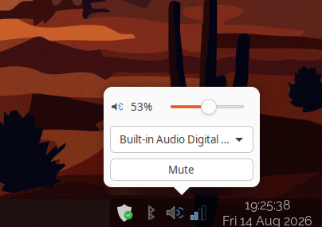
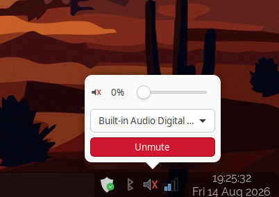

# pw-tray

A deliberately small GTK3/XEmbed volume tray applet for PipeWire/WirePlumber,
built for Openbox + Tint2.



## Controls

- Left click: volume/output popup
- Scroll: volume up/down
- Middle click: mute/unmute
- Right click: output/input selection + Open mixer

## On-screen notifications (optional)

Scrolling or middle-clicking the tray icon (only these two — not the popup,
which is already its own live feedback) will also show a short on-screen
volume/mute notification, **if** a notification daemon is already running
(e.g. `dunst`). This is entirely opt-in: nothing is required to install or
enable, and if no notification daemon is running, these calls simply have
no visible effect — pw-tray never treats that as an error or warns about
it. Uses `notify-send`, part of the `libnotify` packages listed under
"Dependencies" below, if present.

## Architecture

This is a presentation layer only — it doesn't replace PipeWire or
WirePlumber, and doesn't go through the PulseAudio compatibility API. It
talks to the native PipeWire stack via `wpctl`, WirePlumber's control CLI.

The tray icon uses GTK3 `GtkStatusIcon`/XEmbed, which fits Tint2's system
tray. It's intentionally a small, replaceable piece: a future
distro-packaged native PipeWire tray app can swap in for this executable
without changing anything else in the workstation setup.

## Dependencies

Required to build and run: a C compiler, `pkg-config`, GTK3 development
headers, and WirePlumber (for `wpctl`).

**Ubuntu:**

    sudo apt install build-essential pkg-config libgtk-3-dev wireplumber

**Fedora:**

    sudo dnf install gcc make pkgconf-pkg-config gtk3-devel wireplumber

Optional — pw-tray works fully without either of these; see below for what
each affects:

- **Mixer** (`pavucontrol`, or a custom `PWTRAY_MIXER`) — only used by
  "Open mixer" in the right-click menu. If it's not installed, clicking
  that item simply does nothing; pw-tray never treats a missing mixer as
  an error.
  Ubuntu: `sudo apt install pavucontrol` · Fedora: `sudo dnf install pavucontrol`
- **On-screen notifications** — a notification daemon (e.g. `dunst`) and
  `notify-send`. See "On-screen notifications" above.
  Ubuntu: `sudo apt install libnotify-bin` · Fedora: `sudo dnf install libnotify`

## Build

```sh
make
```

## Run without installing

```sh
./pw-tray
```

## Install (current user)

Installs to `~/.local` by default — no root needed:

```sh
make install
```

To start it automatically on login, copy the desktop entry into your
autostart folder yourself:

```sh
mkdir -p ~/.config/autostart
cp data/pw-tray.desktop ~/.config/autostart/
```

Or wire `~/.local/bin/pw-tray &` into your Openbox autostart script directly.

## Install (system-wide)

For packaging or a shared machine, override `PREFIX` (and, if you want
the desktop entry in the conventional system location rather than
`$PREFIX/share/applications`, `DESKTOPDIR`):

```sh
sudo make PREFIX=/usr/local install
# or, to place the desktop entry in /usr/share/applications:
sudo make PREFIX=/usr/local DESKTOPDIR=/usr/share/applications install
```

## Uninstall

```sh
make uninstall            # matches whatever PREFIX you installed with
```

## Configuration

- `PWTRAY_MIXER` — command launched by "Open mixer" (default: `pavucontrol`).
  Optional: if the command isn't installed, clicking "Open mixer" simply
  does nothing.

## License

SPDX-License-Identifier: GPL-3.0-or-later

## Layout

```
.
├── data/           desktop entry (data/pw-tray.desktop)
├── Makefile
├── README.md
└── src/
    ├── pw-tray.h   shared types/constants + module map
    ├── exec.c      process spawning (run/run_async)
    ├── model.c     Node/Snapshot + wpctl status parsing
    ├── actions.c   fire-and-forget wpctl commands
    ├── state.c     tray icon + popup reconciliation
    ├── popup.c     the speech-bubble popup window
    ├── trayicon.c  GtkStatusIcon signals + right-click menu
    ├── osd.c       optional on-screen notifications (notify-send)
    └── main.c      wiring
```
